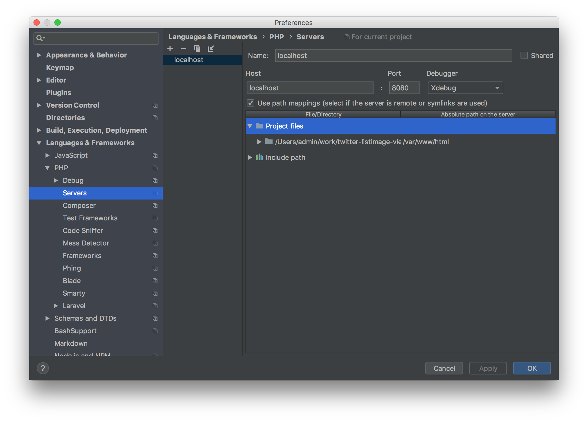

# Docker&Laravel開発環境

## Docker

### 起動

```
docker-compose up -d
```

### 終了

```
docker-compose down
```

### シェル起動

```
# まず、コンテナのIDを調べる
docker container ls

# シェル起動
docker container exec -it [コンテナID] bash
```

## Laravel

### 使用準備

#### 本体インストール

```
composer create-project --no-install --no-scripts laravel/laravel server_src "5.5.*"
```

composerがインストールするパッケージのバージョンをDockerのPHPに合わせるためにこの段階ではパッケージをインストールさせない。なので、`--no-install`を指定。

また、プロジェクト作成時に自動で`php artisan key:generate`が実行されるが、これは`.env`ファイルがないとエラーが出るので`--no-scripts`で抑制。

#### composerがインストールするパッケージのバージョンを、DockerのPHPバージョンと合わせるようにする

`composer.json`を以下の形式で書き換える

```
{
    "require": {
        ~
    },
    "config": {
        ~
        "platform": {
            "php": "7.2.13"
        }
    }
}
```

[composerでPHPのバージョンを制限したい - Qiita](https://qiita.com/kd9951/items/14cddc050745185011ee)

#### パッケージインストール

```
composer install
```

#### `.env`ファイル作成

```
cp .env.example .env
php artisan key:generate
```

## XDebugの使用方法

Docker側の必要な設定は準備済なので、エディタに応じて以下の例のように設定すればいけるはず。

### VSCode

`PHP Debug`拡張を入れて、以下の設定を適用。

```
{
  ~
  "configurations": [
    {
      "name": "Listen for XDebug",
      "type": "php",
      "request": "launch",
      "port": 9000,
      "pathMappings": {
        "/var/www/html": "${workSpaceRoot}"
      }
    },
    ~
  ]
}
```

### PHPStorm

以下の設定例のようにすればいけるはず。

#### `Preference > Language&Frameworks > PHP > Servers`の設定例



#### `Run > Edit Configrations`の設定例


#### 参考

[PhpStormでXdebugを使えるようにしよう！ - Qiita](https://qiita.com/taniai-lvgs/items/8e9eba112d2d0ed2530f)
